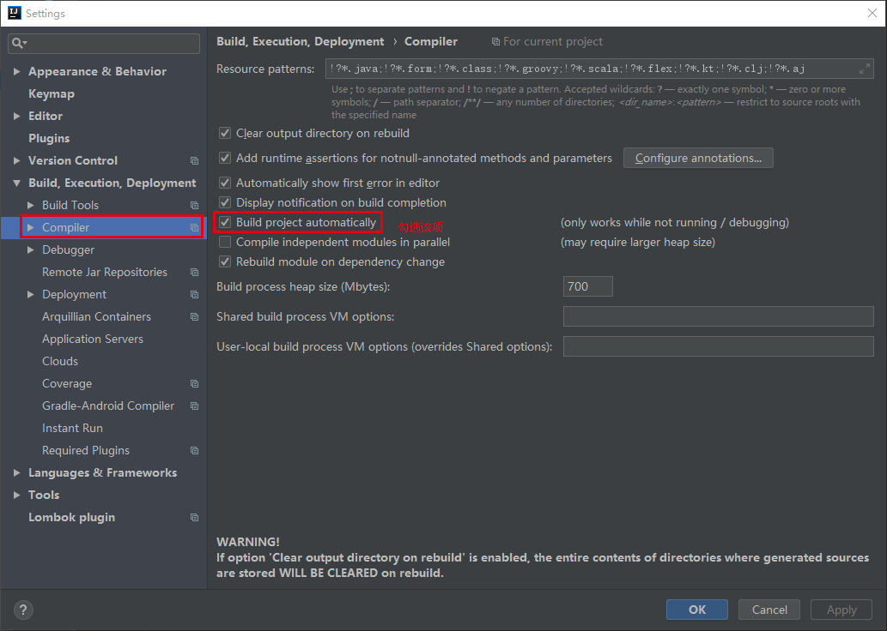
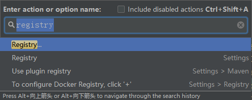
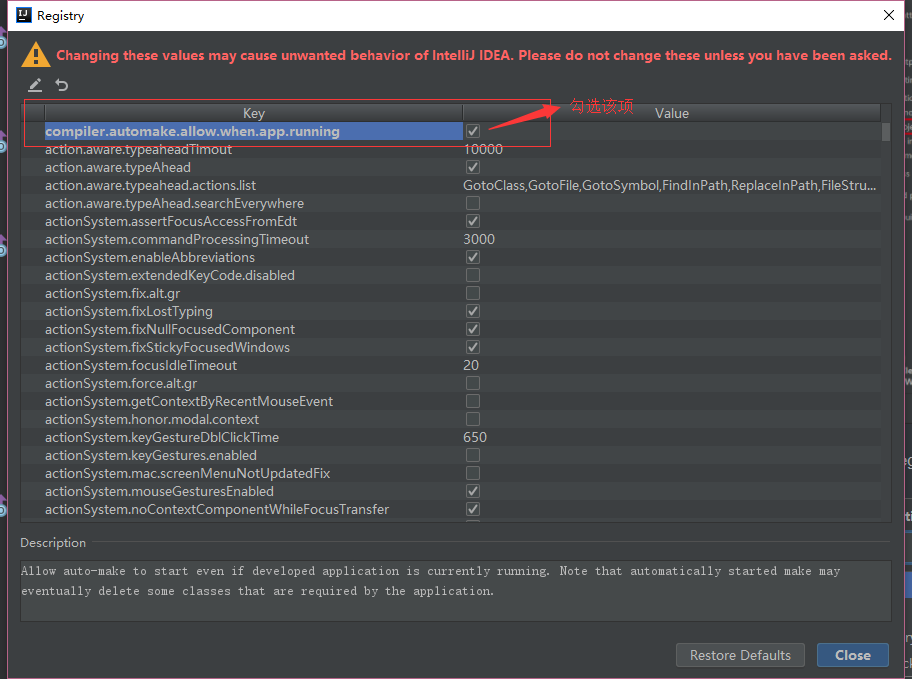

# Springboot 学习笔记

Modules 介绍

Springboot-Devtools：Springboot 集成热部署

## Springboot-Devtools

pom.xml 设置

```xml
<!-- 在 pom.xml 添加依赖 -->
<dependency>
    <groupId>org.springframework.boot</groupId>
    <artifactId>spring-boot-devtools</artifactId>
</dependency>

<!--配置插件-->
<plugin>
    <groupId>org.springframework.boot</groupId>
    <artifactId>spring-boot-maven-plugin</artifactId>
    <configuration>
        <fork>true</fork> <!-- 如果没有该配置，devtools不会生效 -->
    </configuration>
</plugin>
```

在 IDEA 中设置

File——>Setting——>Compiler——>勾选Build project automatically



按下 Ctrl + Shift + A，搜索 registry——>勾选 compiler.automake.allow.when.app.running 即可实现





