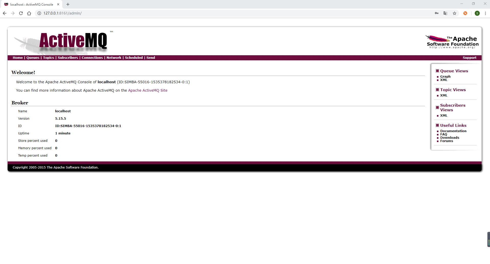

# ActiveMQ的安装(Windows版)

## 下载

ActiveMQ 官网：http://activemq.apache.org/

ActiveMQ 下载地址：http://activemq.apache.org/download.html

## 安装

解压


解压后的目录如下


开启

进入 apache-activemq-5.15.5\bin\win64 ，找到 activemq.bat，双击 activemq.bat 即可


验证

ActiveMQ默认启动时，启动了内置的jetty服务器，提供一个用于监控ActiveMQ的admin应用。 

```
地址：http://127.0.0.1:8161/admin/
默认账号：admin
默认密码：admin
```


