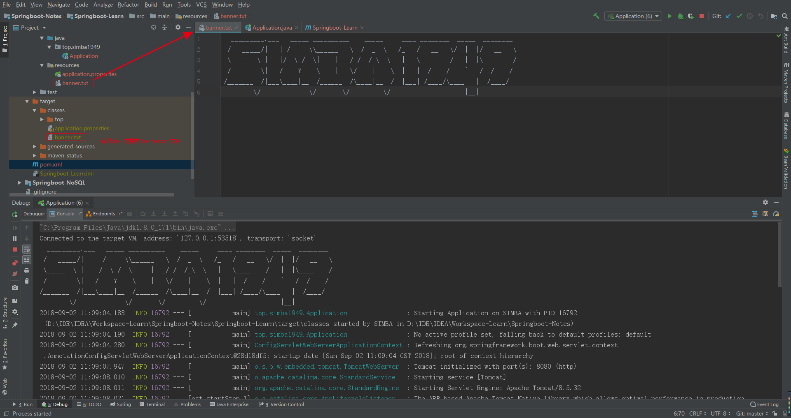
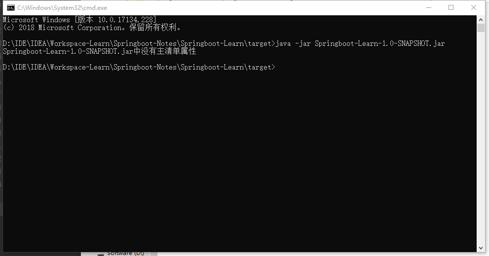
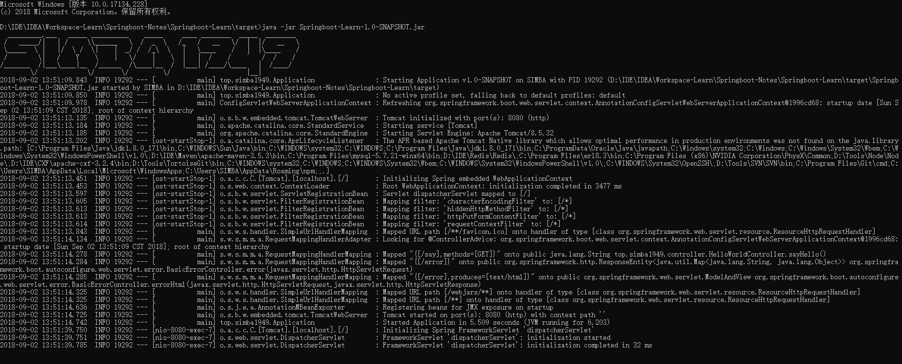

# Springboot学习笔记

## Springboot简单入门

在 pom.xml 添加依赖

```xml
<!--继承springboot默认包-->
<parent>
    <groupId>org.springframework.boot</groupId>
    <artifactId>spring-boot-starter-parent</artifactId>
    <version>2.0.4.RELEASE</version>
</parent>

<properties>
    <!--项目编码-->
    <project.build.sourceEncoding>UTF-8</project.build.sourceEncoding>
</properties>

<dependencies>
    <!--添加springboot相关依赖 start-->
    <dependency>
        <groupId>org.springframework.boot</groupId>
        <artifactId>spring-boot-starter</artifactId>
    </dependency>
    <dependency>
        <groupId>org.springframework.boot</groupId>
        <artifactId>spring-boot-starter-web</artifactId>
    </dependency>
    <dependency>
        <groupId>org.springframework.boot</groupId>
        <artifactId>spring-boot-starter-test</artifactId>
    </dependency>
    <!--添加springboot相关依赖 end  -->
</dependencies>

<build>
    <plugins>
        <!--编译插件-->
        <plugin>
            <groupId>org.apache.maven.plugins</groupId>
            <artifactId>maven-compiler-plugin</artifactId>
            <version>3.5.1</version>
            <configuration>
                <!-- 配置使用的 jdk 版本 -->
                <target>1.8</target>
                <source>1.8</source>
            </configuration>
        </plugin>
        <!-- 资源文件拷贝插件 -->
        <plugin>
            <groupId>org.apache.maven.plugins</groupId>
            <artifactId>maven-resources-plugin</artifactId>
            <version>2.7</version>
            <configuration>
                <encoding>UTF-8</encoding>
            </configuration>
        </plugin>
    </plugins>
    <!--IDEA是不会编译src的java目录的xml文件，如果需要读取，则需要手动指定哪些配置文件需要读取 -->
    <resources>
        <resource>
            <directory>src/main/java</directory>
            <includes>
                <include>**/*.xml</include>
            </includes>
        </resource>
        <resource>
            <directory>src/main/resources</directory>
            <includes>
                <include>**/*.xml</include>
                <include>**/*.properties</include>
            </includes>
        </resource>
    </resources>
</build>
```

创建启动程序

```java
package top.simba1949;

import org.springframework.boot.SpringApplication;
import org.springframework.boot.autoconfigure.SpringBootApplication;

/**
 * @author simba1949@outlook.com
 * @date 2018/9/2 10:26
 */
@SpringBootApplication
public class Application {
    public static void main(String[] args) {
        SpringApplication.run(Application.class,args);
    }
}
```

@SpringBootApplication是SpringBoot的核心注解，是一个组合注解，源码如下

```java
@Target(ElementType.TYPE)
@Retention(RetentionPolicy.RUNTIME)
@Documented
@Inherited
@SpringBootConfiguration
@EnableAutoConfiguration
@ComponentScan(excludeFilters = {
		@Filter(type = FilterType.CUSTOM, classes = TypeExcludeFilter.class),
		@Filter(type = FilterType.CUSTOM, classes = AutoConfigurationExcludeFilter.class) })
public @interface SpringBootApplication {

	@AliasFor(annotation = EnableAutoConfiguration.class)
	Class<?>[] exclude() default {};

	@AliasFor(annotation = EnableAutoConfiguration.class)
	String[] excludeName() default {};

	@AliasFor(annotation = ComponentScan.class, attribute = "basePackages")
	String[] scanBasePackages() default {};

	@AliasFor(annotation = ComponentScan.class, attribute = "basePackageClasses")
	Class<?>[] scanBasePackageClasses() default {};

}
```

## Springboot 配置

### 2.1 关闭特定的自动配置

```java
@SpringBootApplication(exclude = {DataSourceAutoConfiguration.class})
```

### 2.2 定制 Banner

在springboot启动的时候会有一个默认的启动图案


在src/main/resources下新建一个banner.txt，通过<http://patorjk.com/software/taag>网站生成字符，如敲入simba 1949，将网站生成的字符复制在banner.txt中，即可定制

```
  _________.___   _____ __________    _____     ____ ________  _____  ________ 
 /   _____/|   | /     \\______   \  /  _  \   /_   /   __   \/  |  |/   __   \
 \_____  \ |   |/  \ /  \|    |  _/ /  /_\  \   |   \____    /   |  |\____    /
 /        \|   /    Y    \    |   \/    |    \  |   |  /    /    ^   /  /    / 
/_______  /|___\____|__  /______  /\____|__  /  |___| /____/\____   |  /____/  
        \/             \/       \/         \/                    |__|          
```

启动程序，如图



```xml
<!--注：如果classes文件夹下没有 banner.txt 文件，可以在 pom.xml 配置一下-->
<resource>
    <directory>src/main/resources</directory>
    <includes>
        <include>**/*.xml</include>
        <include>**/*.properties</include>
        <include>**/*.txt</include>
    </includes>
</resource>
```

### 2.3 创建一个可执行的jar

添加打包插件

```xml
<!--打包插件-->
<plugin>
  <groupId>org.springframework.boot</groupId>
  <artifactId>spring-boot-maven-plugin</artifactId>
</plugin>
```

命令运行：mvn package

会得到如下jar包

[INFO] Building jar: D:\IDE\IDEA\Workspace-Learn\Springboot-Notes\Springboot-Learn\target\Springboot-Learn-1.0-SNAPSHOT.jar

在命令窗口输入下面命令即可运行：

```cmd
java -jar Springboot-Learn-1.0-SNAPSHOT.jar
```

#### 可能出现的问题

```
Microsoft Windows [版本 10.0.17134.228]
(c) 2018 Microsoft Corporation。保留所有权利。

D:\IDE\IDEA\Workspace-Learn\Springboot-Notes\Springboot-Learn\target>java -jar Springboot-Learn-1.0-SNAPSHOT.jar
Springboot-Learn-1.0-SNAPSHOT.jar中没有主清单属性
```

如图：



解决方案

```xml
<!-- 在pom.xml中添加该插件-->
<plugin>
    <groupId>org.springframework.boot</groupId>
    <artifactId>spring-boot-maven-plugin</artifactId>
</plugin>
```

测试



### 2.4 springboot 配置文件

springboot使用一个全局的配置文件application.properties或者application.yml，放置在src/main/resources目录下或者类路径/config下

读取properties文件时，需要引入依赖包

```xml
<dependency>
    <groupId>org.springframework.boot</groupId>
    <artifactId>spring-boot-configuration-processor</artifactId>
    <optional>true</optional>
</dependency>
```

application.properties

```properties
#定义服务端口
server.port=8081
#修改默认访问路径，添加一层/springboot（注意，必须添加/）
server.servlet.context-path=/springboot
```

### 2.5 Springboot 导入xml配置文件

```java
// 在java类上添加该注解即可
@ImportResource({"classpath:ApplicationContext-tran.xml","classpath:ApplicationContext-dao.xml"})
```

### 2.6 日志配置

```properties
#springboot日志框架默认为logback
#定义日志配置文件位置
#logging.config=
#定义日志文件
#logging.file=
#定义日志打印级别
logging.level.root=info
#logging.exception-conversion-word=
#logging.file.max-history=
#logging.file.max-size=
#logging.path=
#logging.pattern.console=
#logging.pattern.dateformat=
#logging.pattern.file=
#logging.pattern.level=
#logging.register-shutdown-hook=false
```

### 2.7 多配置文件配置

Profile是Spring用来针对不同的环境进行不同的配置提供支持的，全局Profile配置实用application-{profile}.properties。

通过在application.properties中设置spring.profiles.active=dev指定活动的Profile。

* 开发环境：application-dev.properties。
* 测试环境：application-test.properties。
* 生产环境：application-prod.properties。

### 2.8 Favicon配置*

springboot默认开启，关闭favicon在application.properties中配置即可

```properties
spring.mvc.favicon.enabled=false
```

定制Favicon

需要spring.mvc.favicon.enabled开启，不配置默认开启也可，将favicon.ico(文件名不能变动过)放置在src/main/resources/static下即可